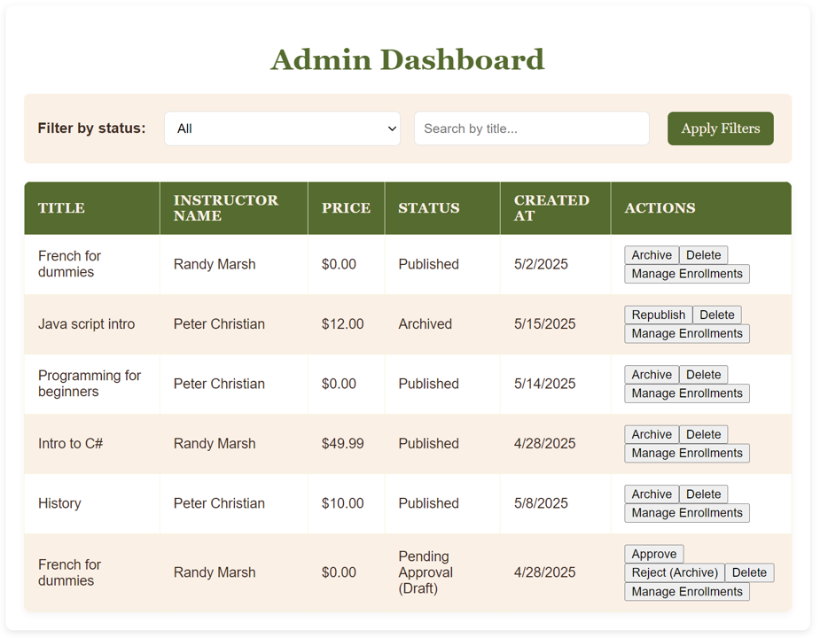

# NerdAcademy

NerdAcademy is an online learning platform. This project provides a full-stack solution for a seamless educational experience.

## Overview

The project consists of:

*   **Frontend**: A vanilla JavaScript, HTML, and CSS client-side application ([`frontend/`](frontend/)).
*   **Backend API**: A .NET Web API ([`NerdAcademy.API/`](NerdAcademy.API/)) handling business logic and data.
*   **Business Logic**: A .NET class library ([`NerdAcademy.Business/`](NerdAcademy.Business/)) containing core application rules and services.
*   **Data Layer**: A .NET class library ([`NerdAcademy.Data/`](NerdAcademy.Data/)) using Entity Framework Core with SQLite for data persistence.
*   **Tests**: Unit and integration tests for the backend ([`NerdAcademy.Tests/`](NerdAcademy.Tests/)).

The solution is managed by [`NerdAcademy.sln`](NerdAcademy.sln:1).

## Key Functionalities

NerdAcademy supports distinct user roles, each with specific privileges to ensure a structured and secure learning environment:

*   **Students**: Can browse available courses and enroll in them to start their learning journey.
*   **Instructors**: Have the ability to create new courses, upload course materials, and manage their existing courses and lessons.
*   **Administrators**: Possess oversight capabilities across the platform. This includes approving new course creations by instructors, managing student enrollments (including approvals or rejections), and having the authority to delete or archive courses as needed.

## Getting Started

### Prerequisites

*   .NET 8.0 SDK
*   A modern web browser

### Backend Setup

1.  Clone the repository.
2.  Navigate to `NerdAcademy.API`.
3.  Run `dotnet restore`.
4.  Run `dotnet run`. The API will be available at `http://localhost:5152` and `https://localhost:7118`.

### Frontend Setup

*   To run the frontend, navigate to the `frontend` directory and execute the command `npx live-server`.

### Database

*   The project uses SQLite.
*   To set up or update the database schema, navigate to the [`NerdAcademy.API/`](NerdAcademy.API/) (or [`NerdAcademy.Data/`](NerdAcademy.Data/)) directory and run:
    ```bash
    dotnet ef database update
    ```

## Screenshots





